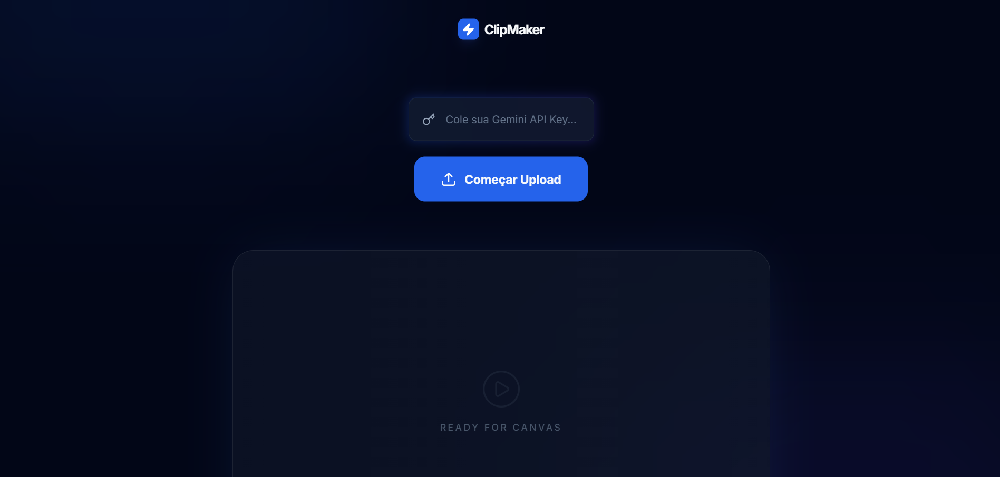

# 🎬 ClipMaker - AI Viral Moments

<p align="center">
  
</p>

<p align="center">
  
  
</p>

> **ClipMaker** é uma ferramenta inteligente que utiliza IA para analisar vídeos, realizar transcrições automáticas e identificar os momentos com maior potencial de viralização.

---

## 💻 Sobre o Projeto

O ClipMaker foi criado para resolver a dor de produtores de conteúdo que precisam minerar "cortes" em vídeos longos. A aplicação utiliza a API do **Cloudinary** para processamento de vídeo e transcrição, permitindo uma análise rápida e eficiente do conteúdo.

### Principais Funcionalidades:
- ✅ **Upload e Hospedagem:** Gerenciamento via Cloudinary.
- ✅ **Transcrição Automática:** Transformação de áudio em texto via IA.
- ✅ **Análise de Virais:** Identificação de momentos chave no vídeo.
- ✅ **Interface Intuitiva:** Desenvolvida com HTML5 e CSS3 moderno.

---

## 🛠 Tecnologias


---

## 🚀 Como testar localmente

1. Clone o repositório:
   ```bash
   git clone [https://github.com/1iigor/ClipMaker.git](https://github.com/1iigor/ClipMaker.git)

2. Configure suas chaves do Cloudinary no arquivo .env (ou direto no JS, se for apenas front-end).

3. Abra o arquivo index.html no seu navegador.